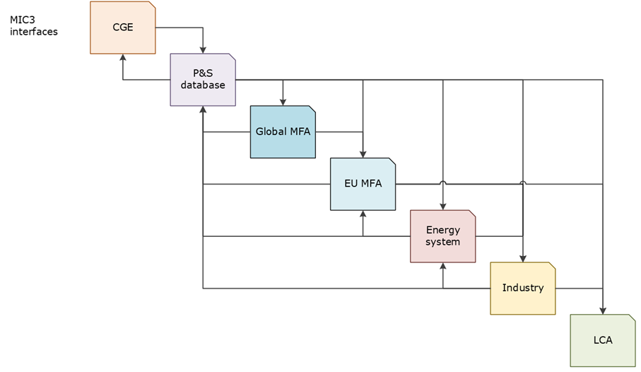
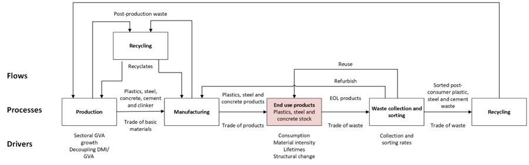
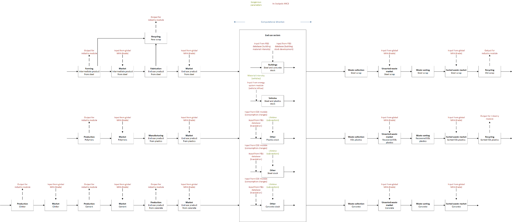
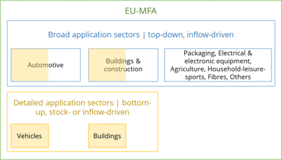

.. note::

   | The EU MFA module is under active development.
   | This documentation is a work-in-progress and will be updated continuously.

Context
------------------------------

The EU MFA module of the MIC3 model framework (Model for European Industry Circularity and Climate Change Mitigation) 
is a multi-regional dynamic Material Flow Analysis (MFA) of the basic materials steel, plastics and cements. 
In the baseline workflow of MIC3 shown in Figure 1, it receives inputs from the Computable General Equilibrium (CGE) module, 
the energy system module, and the global MFA module. The EU MFA provides output for the industry modules. 
Within the MIC3 framework, the EU MFA plays a key role for assessing circular economy measures. 
These relationships are described in detail in other documents. [#f1]_
The present documentation focuses on the design of the EU MFA module.

   Figure 1: Interfaces among the MIC3 modules

The module is built as a succession of processes connected by flows of the basic materials. 
What happens in each process to each flow is driven by exogenous parameters such as consumption levels, product lifetimes, 
trade and waste collection rates, which are set inline with the respective MIC3 scenario definition. 
Figure 2 presents a simplified view of this model design. 

   Figure 2: Simplified model diagram for the EU MFA

The module is programmed in python, built on an adapted version of the ODYM framework, namely `flodym`_.
The main difference to the ODYM framework is a simplified coding of array operations using the einsum function. 
Data inputs occur through pre-formatted csv files and results are saved to csv. It can be run locally on a laptop 
after installing minor requirements.

.. _flodym: https://github.com/pik-piam/flodym

Module design
------------------------------

The EU MFA module is a dynamic MFA, which is represented in a process material flow diagram in Figure 3. 
With the objective of analysing the impact of a circular economy in context of industry decarbonisation, 
the MFA module assesses the three emission-intensive basic materials steel, plastics and cement 
as well as their end use sectors. In general, the future development of material production volumes and 
secondary material availability are driven by the use phase and trade.

   Figure 3: Diagram for the EU MFA module

The EU MFA module incorporates a diverse range of product types across the end use sectors, 
spanning from composite products (e.g., vehicles), 
to mono-material components that form part of composite products (e.g., moulded polyurethane seats in vehicles or PVC profiles in buildings), 
and mono-material stand-alone products (e.g., plastic packaging). 
For this purpose, the MFA module can combine five sub-modules to ensure coverage of all end-use sectors 
and detailed analysis of particularly relevant sub-sectors. 
In detail, this means a bottom-up stock-driven approach for buildings driven by the stock development, 
a bottom-up inflow-driven approach for vehicles driven by new passenger car registrations 
as well as three top-down inflow-driven approaches for steel, plastics and cement in all end use sectors driven by consumption changes. 
In this context, a particular challenge arises from the differentiation between broad application sectors 
(e.g. Automotive, Buildings & construction, Packaging, Electrical & electronics equipment, Agriculture etc.) 
and detailed application sectors that are parts of the broad ones 
(e.g., “vehicles” as part of “Automotive”, “Residential buildings” as part of “Buildings & construction”), see also Figure 4.

   Figure 4: Product and sectoral resolution of the EU MFA module

To ensure consistency between the sub-modules and account for the varying differentiation between broad and detailed application sectors, 
the EU MFA relies on statistical data for a base year. In detail, we use a somewhat different inflow-driven approach than for modelling scenarios. 
The reason is data availability for basic material demand: it is readily available for the “Production” process in the module’s material 
flow diagram. Adding net trade to the “Production” yields final demand, which in turn is the driver-variable 
that is modified in scenario building. In general, the bottom-up material flows for the detailed application sectors 
are subtracted from top-down flows for the respective broad application sector. 
The residual (“Other”) is then extrapolated. Rates of change in consumption delivered from the CGE module as well as translation factors 
from the P&S database will provide the basis for these modifications. 
Therefore, in scenarios, the “Production” is an output of the model, while final demand is an input parameter. 
This approach necessitates a reference development when circular economy measures are considered. 
The circular economy measures affect the top-down and bottom-up inflows independently of each other.

.. rubric:: Footnotes

.. [#f1] D3.3 – Conceptualisation of CE and policy mapping and D3.4 – Framework for industry transition modelling  
