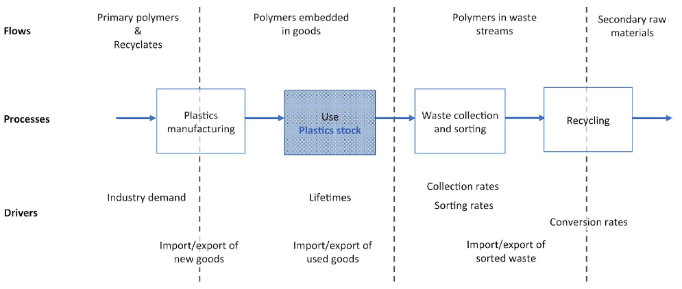
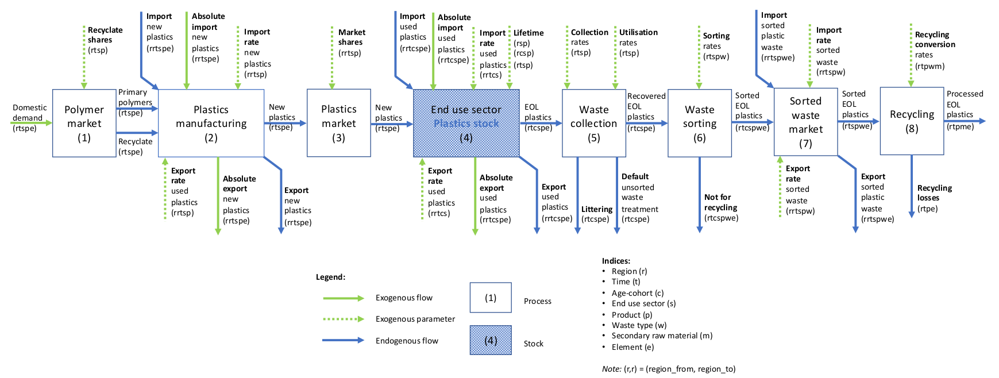

.. note::

   | The EU MFA module is under active development.
   | This documentation is a work-in-progress and will be updated continuously.

******************************
Plastics
******************************

Design
========================

The plastics sub-module is a multi-regional dynamic
Material Flow Analysis (MFA) of polymers. 
It is built as a succession of *processes* connected by *flows*
of polymers, either fresh, embedded in products, or mixed in wastes.
What happens in each process to each flow is driven by exogenous
*parameters* such as product lifetimes and waste collection rates set by
the user to construct a scenario. The figure below presents a simplified view of this model
design.

   Simplified diagram for the plastics sub-module

In reality, the model includes a larger number of processes and flows, 
represented in the following flow diagram (see Figure below). The
code implements this design using `flodym`_, an adaptation of the `ODYM`_
framework. Some general-level explanation are in order:

.. _flodym: https://github.com/pik-piam/flodym
.. _ODYM: https://github.com/IndEcol/ODYM

*   If a flow or parameter is indexed with e.g. (r,t,c,s,p,e) it means
    that the model expects values for this flow or parameter for each
    combination of regions (r), years (t), age cohorts (c), use sectors
    (s), polymers (p), and elements (e). Index combinations for which
    input data is not provided receive zero as default value or in some
    cases may be filled out through interpolation.

*   The term \"polymers\" in the diagram refers to polymers that have not
    yet been actually processed into finished products. The term
    \"plastics\" refers to goods containing plastics such as packaging,
    cars, etc. The model does not quantify, for example, how many cars
    are produced, but how many tonnes of plastics, differentiated by
    type of polymer, are contained in the cars produced.

*   The index (e) allows us to track individual elements in the plastic
    product flows. In addition to the total mass of plastic product
    flows (e = All), the carbon content (e = C) and the contamination of
    a polymer flow by nitrogen from biopolymers (e = N), for example,
    could be quantified and tracked. *Note that this possibility does
    exist but is not currently used*.

.. _plastics-full-diagram:

   Full diagram for the plastics sub-module

Indices
========================

Parameters
========================

The following table presents the data structure and signification of all
input parameters expected by the model.

.. csv-table::
    :header-rows: 1
    :file: tables/parameters_plastics.csv

Variables
========================

.. csv-table::
    :header-rows: 1
    :file: tables/variables_plastics.csv

Processes
========================

The following presents the equations governing each of the processes
presented in :ref:`plastics-full-diagram`. For each process we provide a short
description in plain English, an explanation of the exogenous parameters
and model variables, and an algebraic formulation of the equations
governing the process. For the parameters and variables we can use both
common names as in the diagram and code names as in the algebraic
formulation.

Process (1) "Polymer market"
--------------------------------

Demand for polymers from the domestic processing industries is satisfied
with either "fresh" polymers (from primary raw materials or from
chemical recycling) or recyclates (secondary polymers or granulates from
mechanical recycling).

Exogenous parameters
^^^^^^^^^^^^^^^^^^^^^^^^^^^^^^^

The main exogenous driver for the model is the exogenous flow *Domestic
demand for polymers* (P1_DomesticDemand). The model expects demand by
region, sector, and polymer in million tons. Ideally statistical data
could be used for historical demand and extrapolated into the future
based on scenario assumptions. In our case, however, we rely on
converting economic data (GVA of sectors) into demand for polymers in
unit of mass before feeding this data into the model. For that purpose,
we use a multi-variable regression function calculated outside the model
in Excel. The parameter *Recyclate shares* (P1_RecyclateShare)
exogenously sets the ratio between "fresh" polymers and recyclates in
satisfying polymer demand.

Model variables
^^^^^^^^^^^^^^^^^^^^^^^^^^^^^^^

The flow Primary polymers (F_1\_2_Primary) is the fraction of *Domestic
demand for polymers* (P1_DomesticDemand) satisfied with "fresh" polymers
while the *Recyclates* (F_1\_2_Recyclate) flow is the fraction satisfied
with granulates of secondary material from mechanical recycling.

Algebraic formulation
^^^^^^^^^^^^^^^^^^^^^^^^^^^^^^^

F_1\_2_Recyclate = P1_DomesticDemand \* P1_RecyclateShare

F_1\_2_Primary = P1_DomesticDemand -- F_1\_2_Recyclate

Process (2) "Plastics manufacturing"
---------------------------------------

Short description
^^^^^^^^^^^^^^^^^^^^^^^^^^^^^^^

Polymers (fresh or recyclates) are formed into either stand-alone
plastic products (e.g. packaging) or plastic parts for other products
(e.g. car parts). Plastics goods or goods containing plastics are also
imported and exported.

Exogenous parameters
^^^^^^^^^^^^^^^^^^^^^^^^^^^^^^^

The exogenous flows *Absolute import new plastics* (P2_ImportNew) and
*Absolute export new plastics* (P2_ExportNew) allow for absolute import
and export of new products containing plastics. The parameters *Import
rate new plastics* (P2_ImportRateNew) and *Export rate new plastics*
(P2_ExportRateNew) also allow for import and export of new products
containing plastics, calculated as a rate applied to *Domestic demand
for polymers* (P1_DomesticDemand).

Model variables
^^^^^^^^^^^^^^^^^^^^^^^^^^^^^^^

The endogenous flows *Import new plastics* (F_0\_2_ImportNew) and
*Export new plastics* (F_2\_0_ExportNew) represent total import and
export, respectively, calculated as the sum of the absolute flows
provided exogenously and the import and export calculated using
exogenously provided rates. The variable *New plastics*
(F_2\_3_NewPlastics) is the net result of the mass balance between the
flows *Primary polymers* (F_1\_2_Primary), *Recyclates*
(F_1\_2_Recyclate), *Import new plastics* (F_0\_2_ImportNew), and
*Export new plastics* (F_2\_0_ExportNew).

Algebraic formulation
^^^^^^^^^^^^^^^^^^^^^^^^^^^^^^^^

*\# Internal variable for input flow to process 2*

InputManufacturing_1\_2 = F_1\_2_Primary + F_1\_2_Recyclate

*\# Import and export*

F_0\_2_ImportNew = P2_Plastics_ImportNew +

(InputManufacturing_1\_2 \* P2_ImportRateNew)

F_2\_0_ExportNew = P2_Plastics_ExportNew + (InputManufacturing_1\_2 \*
P2_ExportRateNew)

*\# Sum over all import and export regions to calculate net imports,
saved in internal variable*

ImportNew_0\_2 = sum\[ F_0\_2_ImportNew\[rr,r\] for rr in regions \]

ExportNew_2\_0 = sum\[ F_2\_0_ExportNew\[r,rr\] for rr in regions \]

NetImportNew_0\_2 = ImportNew_0\_2 -- ExportNew_2\_0

*\# Mass balance equation*

F_2\_3_NewPlastics = F_1\_2_Primary + F_1\_2_Recyclate +
NetImportNew_0\_2

Process (3) "Plastics market"
--------------------------------

Short description
^^^^^^^^^^^^^^^^^^^^^^^^^^^^^^^^

This process allows the user to run the model at a different
geographical resolution for the demand side (processes 1 and 2) and
stock and waste generation side (processes 4 to 8). For example the
demand and import/export of polymers and plastic products could be
provided at the EU level while the stocks and recycling potentials from
plastic waste generation could be obtained at the EU member level, all
in the same model run.

Exogenous parameters
^^^^^^^^^^^^^^^^^^^^^^^^^^^^^^^^

The parameter Market share (P3_MarketShare) defines the share of a
(smaller) region in a (larger) region's new plastics final demand
(F_2\_3_NewPlastics).

Model variables
^^^^^^^^^^^^^^^^^^^^^^^^^^^^^^^^

The variable New plastics (F_3\_4_NewPlastics) is the New plastics
(F_2\_3_NewPlastics) of the previous process distributed to more regions
according to their market shares.

Algebraic formulation
^^^^^^^^^^^^^^^^^^^^^^^^^^^^^^^^

F_3\_4_NewPlastics = F_2\_3_NewPlastics \* P3_MarketShare

Process (4) "End use sectors"
-------------------------------

Short description
^^^^^^^^^^^^^^^^^^^^^^^^^^^^^^^^

Plastic containing products of each considered age cohort reside in the
stocks associated with end use sectors until they leave the stock, that
is until they reach the end of their technical lifetime or are exported
as used goods. New products enter the stock every year, while
end-of-life products leave it as waste. Some used goods (from an older
age-cohorts) can be imported and exported too, that is enter or leave
the stock, in the latter case not as waste. The calculations involved in
this process are quite convoluted and entail many more steps than for
other processes. The algebraic formulation below attempts to provide an
overview of those steps.

Exogenous parameters
^^^^^^^^^^^^^^^^^^^^^^^^^^^^^^^^

...

Model variables
^^^^^^^^^^^^^^^^^^^^^^^^^^^^^^^^^

...

Algebraic formulation
^^^^^^^^^^^^^^^^^^^^^^^^^^^^^^^^^

...

Process (5) "Waste collection"
----------------------------------

Short description
^^^^^^^^^^^^^^^^^^^^^^^^^^^^^^^^^

The *EOL plastics* flow exiting the stock (see previous section) goes
through two processing steps in process 5:

1.  Collection: some share of this flow is collected while the rest
    exits the system as littering or dissipative losses.

2.  Utilisation: of this collected EOL plastics another share is sent to
    further sorting while the remainder goes through whatever is the
    domestic default waste unsorted treatment. For example, in Germany
    the former flow sent to sorting would cover the "gelbe Tonne",
    "Pfandsystem", shredder light fraction, and demolition waste, while
    the latter would be the "schwarze Tonne" sent to the municipal waste
    incinerator with energy recovery ( in other country the default
    treatment may be incineration without energy recovery or landfill,
    or a combination of different routes).

Exogenous parameters
^^^^^^^^^^^^^^^^^^^^^^^^^^^^^^^^^

The parameter *Collection rates* (P5_EoLCollectionRate) describes which
share of the flow EOL plastics (F_4\_5_EOLPlastics) is collected. The
parameter *Utilisation rates* (P5_EoLUtilisationRate) describes which
share of the collected waste is sent to further sorting.

Model variables
^^^^^^^^^^^^^^^^^^^^^^^^^^^^^^^^^

The flow *Recovered EOL plastics* (F_5\_6_RecoveredEOL) represents the
share of the flow *EOL plastics* (F_4\_5_EOLPlastics) that is collected
and sent to further sorting. The flow *Littering* (F_5\_0_Littering) is
not collected in the first place and irremediably lost. The flow
*Default unsorted waste treatment* (F_5\_0_DefaultTreatment) is the
share of collected waste not sent to further sorting.

Algebraic formulation
^^^^^^^^^^^^^^^^^^^^^^^^^^^^^^^^^

*\# "Collection"*

Collected_F\_4_5 = F_4\_5_EOLPlastics \* P5_EoLCollectionRate

*\# "Utilisation"*

Utilised_F\_4_5 = Collected_F\_4_5 \* P5_EoLUtilisationRate

*\# Mass balance equation*

F_5\_6_RecoveredEOL = Utilised_F\_4_5

F_5\_0_Littering = F_4\_5_EOLPlastics -- Collected_F\_4_5

F_5\_0_DefaultTreatment = Collected_F\_4_5 -- Utilised_F\_4_5

Process (6) "Waste sorting"
-----------------------------

Short description
^^^^^^^^^^^^^^^^^^^^^^^^^^^^^^^^^

*Recovered EOL plastics* (F_5\_6_RecoveredEOL) is domestically sorted
into waste fractions defined by the user depending on the expected EOL
material's quality. The user can define as many waste categories as she
wants (data availability is often the limiting factor). The model
differentiates between categories destined to further recycling
(mechanical or chemical) from those categories that will not be recycled
(could be incinerated with or without energy recovery or landfilled).
For example, a share of packaging waste may be sorted in such a way that
it is suitable for mechanical recycling, while another share ends up as
refuse derived fuel, which is "not for recycling".

Exogenous parameters
^^^^^^^^^^^^^^^^^^^^^^^^^^^^^^^^^

The parameter *Sorting rates* (P6_SortingRates) describes the shares of
collected waste flowing to waste categories defined by the user. Some of
these waste categories are not suitable for recycling and those should
be listed in the config file in the section "Model flow control" under
the item "Waste_Types_Not_For Recycling".

Model variables
^^^^^^^^^^^^^^^^^^^^^^^^^^^^^^^^^

The output flow *Sorted EOL plastics* (F_6\_7_SortedEOL) represents how
much of each polymer from each sector ends up in each of those waste
categories belonging to the "recycling fraction". The *Not for
recycling* (F_6\_0_NotForRecycling) flow shows how much of each polymer
from each sector ends up in those waste categories that cannot be
mechanically or chemically recycled.

Algebraic formulation
^^^^^^^^^^^^^^^^^^^^^^^^^^^^^^^^^

*\# All sorted waste*

SortedWaste = F_5\_6_RecoveredEOL \* P6_SortingRates

*\# Splitting sorted waste in "for recycling" and "not for recycling"*

for w in waste categories:

if w in Waste_Types_Not_For Recycling (defined in config):

F_6\_7_SortedEOL\[w\] = 0

F_6\_0_NotForRecycling\[w\] = SortedWaste\[w\]

else:

F_6\_7_SortedEOL\[w\] = SortedWaste\[w\] F_6\_0_NotForRecycling\[w\] = 0

Process (7) "Sorted waste market"
-------------------------------------

Short description
^^^^^^^^^^^^^^^^^^^^^^^^^^^^^^^^^

A region with a mechanical recycling industry may import suitable sorted
waste, which in turn is exported from another region. Refuse derived
fuels may also be traded between regions where one collects and sorts
waste and the other has cement plants. This process 7 allows to model
these flows.

Exogenous parameters
^^^^^^^^^^^^^^^^^^^^^^^^^^^^^^^^^

The parameters *Import rate sorted waste* (P7_ImportRateSortedWaste) and
*Export rate sorted waste* (P7_ExportRateSortedWaste) represent which
waste categories are imported and exported, respectively. The absolute
import flow is calculated as a rate applied to the total domestic sorted
waste flow. The absolute export flow is calculated as a rate applied to
the total domestic sorted waste flow + import.

Model variables
^^^^^^^^^^^^^^^^^^^^^^^^^^^^^^^^^

The variables *Import sorted plastic waste* (P7_ImportRateSortedWaste)
and *Export sorted plastic waste* (P7_ExportRateSortedWaste) represent
the absolute import and export flows, respectively of sorted waste
calculated from the rates provided as parameters. The next *Sorted EOL
plastics* (F_7\_0_SortedEOL) variable represents the flow of domestic
sorted waste augmented or reduced by the net imports of sorted waste.

Algebraic formulation
^^^^^^^^^^^^^^^^^^^^^^^^^^^^^^^^^

*\# Sum up all age-cohorts and waste categories to get total domestic
sorted waste*

SortedEOL_agg = sum\[ F_6\_7_SortedEOL\[c,w\]

for all c in age-cohorts and w in waste types \]

*\# Import*

F_0\_7_ImportSorted = SortedEOL_agg \* P7_ImportRateSortedWaste

*\# Domestic sorted waste + import*

SortedEOL_F\_7_8 = sum\[ F_6\_7_SortedEOL\[c\] for c in age-cohorts \] +

sum\[ F_0\_7_ImportSorted\[rr,r\] for r in regions \]

*\# Export*

F_7\_0_ExportSorted = SortedEOL_F\_7_8 \* P7_ExportRateSortedWaste

*\# Net domestic flow of sorted waste*

F_7\_8_SortedEOL = SortedEOL_F\_7_8 --

sum\[ F_7\_0_ExportSorted\[r,rr\] for rr in regions \]

Process (8) "Recycling"
------------------------

Short description
^^^^^^^^^^^^^^^^^^^^^^^^^^^^^^^^^

Recycling, be it mechanical or chemical, transforms sorted waste
fractions into secondary raw materials, with some losses.

Exogenous parameters
^^^^^^^^^^^^^^^^^^^^^^^^^^^^^^^^^

The parameter *Recycling conversion rates* (P8_RecyclingConversionRate)
represents the share of each sorted waste type recycled to each type of
secondary material. For example, sorted waste for mechanical recycling
could be recycled into one type of secondary materials (granulates) with
a yield given by the Recycling conversion rate. Sorted waste for
pyrolysis, on the other hand, could be transformed into several flows of
secondary materials (e.g. pyrolysis oil, gas, and solid residue).

Model variables
^^^^^^^^^^^^^^^^^^^^^^^^^^^^^^^^^

The variable *Processed EOL plastics* (F_8\_0_ProcessedEOL) flow
encompasses the secondary materials (defined by the user) that can
either directly replace primary polymers (granulates from mechanical
recycling) and monomers (from solvolysis) or replace fossil feedstock
(e.g. pyrolysis oil in a steam cracker). The variable *Recycling losses*
(F_8\_0_Losses) encompasses the losses of the recycling process that may
not be used elsewhere.

Algebraic formulation
^^^^^^^^^^^^^^^^^^^^^^^^^^^^^^^^^

*\# Recycled flow*

F_8\_0_ProcessedEOL= F_7\_8_SortedEOL \* P8_RecyclingConversionRate

*\# Aggregate sorted waste over all sectors and waste types*

Sorted_F\_7_8 = sum\[ F_7\_8_SortedEOL\[s,w\]

for s in sectors and w in waste types \]

*\# Aggregate recycled plastics over all secondary materials*

Recycled_F\_8_0 = sum\[ F_8\_0_Processed\[m\] for m in secondary
materials \]

*\# Losses from mass balance*

F_8\_0_Losses = Sorted_F\_7_8 -- Recycled_F\_8_0
