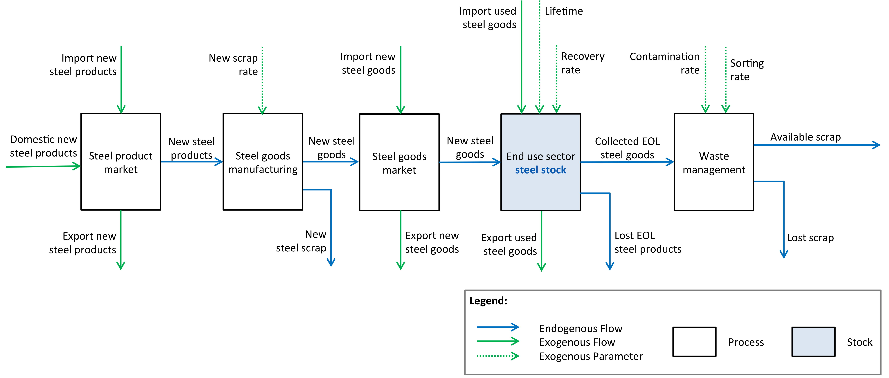
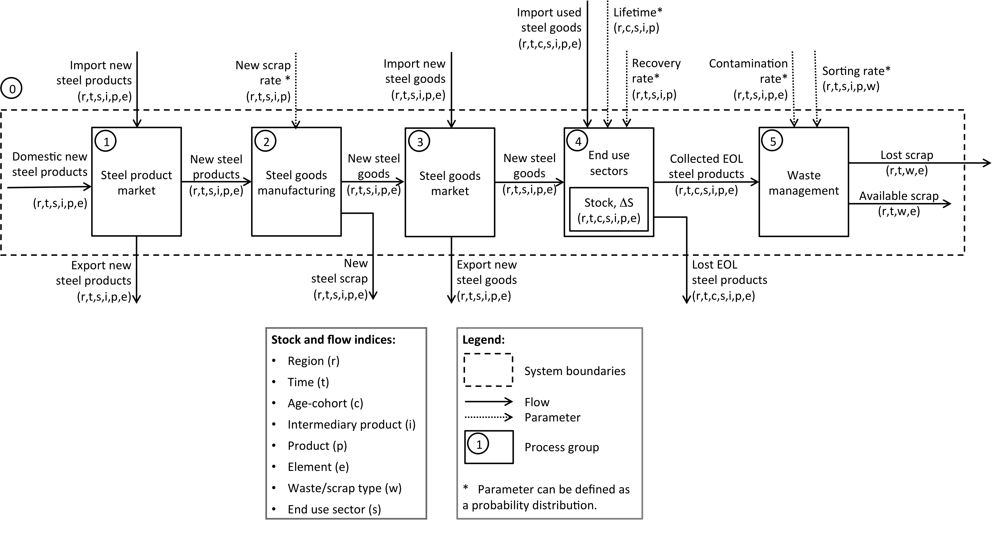

.. note::

   | The EU MFA module is under active development.
   | This documentation is a work-in-progress and will be updated continuously.

******************************
Steel
******************************

Design
========================

The steel sub-module is a dynamic
Material Flow Analysis (MFA) of steel products. 
It is built as a succession of *processes* connected by *flows*
of steel, either as semi-finished products, embedded in goods, or in scrap.
It accounts for the contamination of steel scrap with copper.
What happens in each process to each flow is driven by exogenous
*parameters* such as product lifetimes and scrap collection rates set by
the user to construct a scenario. The figure below presents a simplified view of this model
design.

   Simplified diagram for the steel sub-module

The following flow diagram (see Figure below) shows details about parameters and varibales.
The code implements this design using `flodym`_, an adaptation of the `ODYM`_
framework. Some general-level explanation are in order:

.. _flodym: https://github.com/pik-piam/flodym
.. _ODYM: https://github.com/IndEcol/ODYM

*   If a flow or parameter is indexed with e.g. (r,t,c,s,p,e) it means
    that the model expects values for this flow or parameter for each
    combination of regions (r), years (t), age cohorts (c), use sectors
    (s), products (p), and elements (e). Index combinations for which
    input data is not provided receive zero as default value or in some
    cases may be filled out through interpolation.

*   The term \"products\" in the diagram refers to semi-finished products. The term
    \"goods\" refers to finished products (packaging, cars etc.) manufactured with semi-finished steel products
    and possibly other materials. The model does not quantify, for example, how many cars
    are produced, but how many tonnes of steel, differentiated by
    type of semi-finished products, are contained in the cars produced.

*   The index (e) allows us to track individual elements in the steel
    product and scrap flows. In addition to the total mass of steel
    flows (e = All), the copper contamination (e = Cu) is also tracked.
    *Note that further contaminants could be considered but is not currently implemented in our datasets*.

.. _steel-full-diagram:

   Full diagram for the steel sub-module

Indices
========================

The following table presents the dimensions indexing the parameters and variables (stock and flows)
of the MFA model for steel.

.. csv-table::
    :header-rows: 1
    :file: tables/indices_steel.csv

*Note:* the meaning of the index “element” (All or Cu) can be misleading. The All index actually refers to the entire steel product while the Cu index refers to the copper contamination contained in that product.
For example a scrap flow of 100 kg with known 3% copper contamination would look like in the table below.

.. csv-table::
    :header-rows: 1
    :file: tables/example_steel_1.csv

Parameters
========================

The following table presents the data structure and signification of all
input parameters expected by the MFA model for steel.

.. csv-table::
    :header-rows: 1
    :file: tables/parameters_steel.csv

Variables
========================

.. csv-table::
    :header-rows: 1
    :file: tables/variables_steel.csv

Processes
========================

The following presents the equations governing each of the processes
in the :ref:`steel-full-diagram`. For each process we provide a short
description in plain English, an explanation of the exogenous parameters
and model variables, and an algebraic formulation of the equations
governing the process. For the parameters and variables we can use both
common names as in the diagram and code names as in the algebraic
formulation.

.. note::

   | We present here the *production-driven* approach used to calibrate the model with historical data and to build the baseline scenario. In that setting the first flow on the left of the :ref:`steel-full-diagram` (domestic production of semi-finished steel products) is an *exogenous parameter*. The consumption flow between the  processes "Steel goods market" and "End use sectors" is a *model variable*.
   | Not detailed here but trivial to derive from the production-driven approach is the *consumption-driven* approach. In that case the consumption flow (new steel in goods entering the use sector stock) is an *exogenous parameter*. The flows left  of it in the :ref:`steel-full-diagram` are then calculated backwards. The domestic production flow of semi-finished steel products is a *model variable*.
   | Both approaches have their own merits depending on the research question and data availability.

Process (1) "Steel product market"
------------------------------------

Short description
^^^^^^^^^^^^^^^^^^^^^^^^^^^^^^^

Steel flows in our MFA model starts in each region with a market for semi-finished steel product.
The logic is that of a simple mass balance between domestic production, import, and export.

Exogenous parameters
^^^^^^^^^^^^^^^^^^^^^^^^^^^^^^^

The flows F_0_1_DomesticProduction and F_0_1_Import represent the domestic production and import of semi-finished steel products, respectively.
The flow F_1_0_Export represents the export of semi-finished steel products.
These flows are initialised with exogenous input data, which can come from another model.

Model variables
^^^^^^^^^^^^^^^^^^^^^^^^^^^^^^^

The flow F_1_2 represents the total amount of steel in semi-finished products available for further processing in the next process.

Algebraic formulation
^^^^^^^^^^^^^^^^^^^^^^^^^^^^^^^

F_1_2_NewProducts  =  F_0_1_Domestic  +  F_0_1_Import  -  F_1_0_Export

Process (2) "Steel goods manufacturing"
------------------------------------------

Short description
^^^^^^^^^^^^^^^^^^^^^^^^^^^^^^^

The manufacturing process turns semi-finished steel products into finished steel goods.
This process generates production waste also referred to as new scrap.
The new scrap is a flow of steel that is not embedded in the manufactured steel good and constitutes a high quality scrap for secondary steel production.
The logic of the process is again that of a simple mass balance between the input of semi-finished steel products and the losses through new scrap.

Exogenous parameters
^^^^^^^^^^^^^^^^^^^^^^^^^^^^^^^

NewScrapRate is a ratio.
For example 0.05 means that 5% of a given steel product flowing into “Steel goods manufacturing” ends up as new scrap in the production process 
(e.g. a window being stamped out of a flat product in the automobile industry).
The remaining 95% are embedded in the manufactured steel good.

Model variables
^^^^^^^^^^^^^^^^^^^^^^^^^^^^^^^

The flow F_2_3_NewGoods represents the total amount of steel in finished goods available for trade or final consumption.
The flow F_2_0_NewScrap represents the new scrap generated in the manufacturing process and available for recycling.

Algebraic formulation
^^^^^^^^^^^^^^^^^^^^^^^^^^^^^^^

F_2_3_NewGoods  =  F_1_2_NewProducts * (1 - NewScrapRate)

F_2_0_NewScrap  =  F_1_2_NewProducts * NewScrapRate

Process (3) "Steel goods market"
------------------------------------------

Short description
^^^^^^^^^^^^^^^^^^^^^^^^^^^^^^^

This process represents a market for finished goods containing steel products.
The logic is that of a simple mass balance between domestic production, import, and export.

Exogenous parameters
^^^^^^^^^^^^^^^^^^^^^^^^^^^^^^^

The flow F_0_3_Import and F_3_0_Export represents the import and export of goods containing steel products from other regions, respectively.

Model variables
^^^^^^^^^^^^^^^^^^^^^^^^^^^^^^^

F_3_4_NewGoods represents the total amount of steel entering the end-use sector stocks in new finished goods through final consumption.

Algebraic formulation
^^^^^^^^^^^^^^^^^^^^^^^^^^^^^^^

F_3_4_NewGoods  =  F_2_3_NewGoods  +  F_0_3_Import  -  F_3_0_Export

Process (4) "End use stock"
------------------------------------------

Short description
^^^^^^^^^^^^^^^^^^^^^^^^^^^^^^^

Steel containing goods of each considered age cohort reside in the
stocks associated with end use sectors until they leave the stock, that
is until they reach the end of their technical lifetime. New goods enter the stock every year, while
end-of-life products leave it as scrap, of which only a fraction is properly collected and remains available for further processing.

The lifetime probability distributions entered as exogenous parameters are fed into the dynamic stock model
which then internally calculates the corresponding probability density functions (used to determine the probability 
for a given cohort to exit the stock in any given year).

The fate of the initial stock is first calculated, then the stock resulting from the flow F_3_4_NewGoods is computed.
Together, this determines the dynamics of the stock over the entire modelling period, including the outflow from the stock.

Exogenous parameters
^^^^^^^^^^^^^^^^^^^^^^^^^^^^^^^

Lifetime represents the average lifetime of each age cohort of each steel product.
For example for a given product, the age cohort 1980 (i.e. product enters the end-use sector stock in 1980) 
may have a shorter expected lifetime than the cohort 2020 because the newer products are better built. 
Note, however, that in the current baseline datase, it is not assumed that lifetimes vary with age-cohort like in the example above.

EoLRecoveryRate is a ratio. For example 0.8 means that 80% of a given steel product is recovered at end-of-life 
and further processed in the waste management process within our system boundaries. 
The remaining 20% escape our system boundaries.

Model variables
^^^^^^^^^^^^^^^^^^^^^^^^^^^^^^^

F_4_5_EoL represents the total amount of steel in end-of-life goods collected and sent to sorting.
F_4_0_Lost represents the total amount of steel in end-of-life goods that escape our system boundaries.

Algebraic formulation
^^^^^^^^^^^^^^^^^^^^^^^^^^^^^^^

...

F_4_5_EoL  =  StockOutflow * EoLRecoveryRate

F_4_0_Lost  =  StockOutflow  -  F_4_5-EoL          

Process (5) "Waste management""
------------------------------------------

Short description
^^^^^^^^^^^^^^^^^^^^^^^^^^^^^^^

A “virtual” intermediary flow (i.e. this flow does not appear in the :ref:`steel-full-diagram`) is computed to account 
for the copper contamination of steel flows during handling of EoL steel products. 
The exogenous contamination coefficient is a multiplier that should be applied to the steel flow to obtain 
the amount of copper entering the flow. The total copper contamination is stored under the corresponding chemical 
element index Cu while the chemical element index All (which accounts for the total mass of the steel product or scrap flow) 
should account for the additional mass of copper now mixed with the flow.

Then a simple mass balance is performed to calculate the amount of steel scrap available for recycling after sorting.

Exogenous parameters
^^^^^^^^^^^^^^^^^^^^^^^^^^^^^^^

The Contamination parameter represents, strictly speaking, the new contamination resulting from steel scrap management.
In the baseline datasets (and probably in most scenarios, due to lack of data on contamination of current and past product stocks and flows), 
however, it is used to represent the total contamination in scrap flows.
Concretely, here is an example with 3% copper contamination resulting from waste management:
	
- Collected EoL steel products (summed over all age cohorts):

.. csv-table::
    :header-rows: 1
    :file: tables/example_steel_2.csv

- Contamination factors:

.. csv-table::
    :header-rows: 1
    :file: tables/example_steel_3.csv

- Contaminated EoL steel products:

.. csv-table::
    :header-rows: 1
    :file: tables/example_steel_4.csv

ScrapSortingRate is a ratio. For example 0.5 means that 50% of a given steel EoL product flow is sorted 
into a specific scrap type available for secondary steel production within our system boundaries.
The remaining 50% can either be sorted into another scrap type or escape our system boundaries, or both.

Model variables
^^^^^^^^^^^^^^^^^^^^^^^^^^^^^^^

F_4_5_Contaminated represents the total amount of steel in end-of-life goods collected and sent to sorting, including the copper contamination.
F_5_0_AvailableScrap represents the total amount of steel in end-of-life goods that is available for recycling after sorting.
F_5_0_LostScrap represents the total amount of steel in end-of-life goods that escape our system boundaries after sorting.

Algebraic formulation
^^^^^^^^^^^^^^^^^^^^^^^^^^^^^^^

F_4_5 _Contaminated [Cu]  =  F_3_4 [Cu]  +  F_3_4 [All]  *  Contamination [Cu]

F_4_5 _Contaminated [All]  =  F_3_4 [All]  *  ( 1  +  Contamination [Cu] )          

F_5_0_AvailableScrap + F_5_0_LostScrap  =  F_3_4_Contaminated

F_5_0_AvailableScrap  =  F_4_5_Contaminated  *  ScrapSortingRate

F_5_0_LostScrap  =  F_4_5_Contaminated  -  F_5_0_AvailableScrap          
